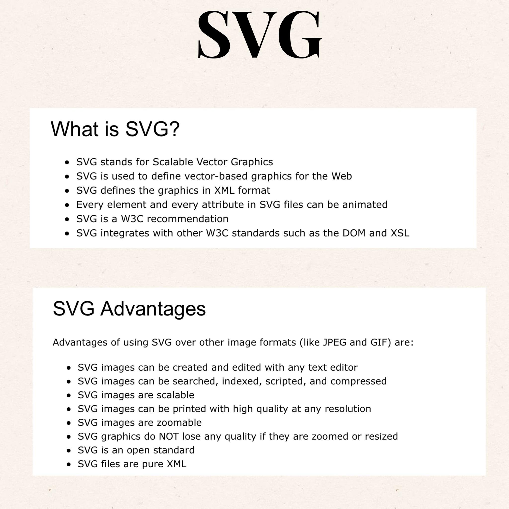
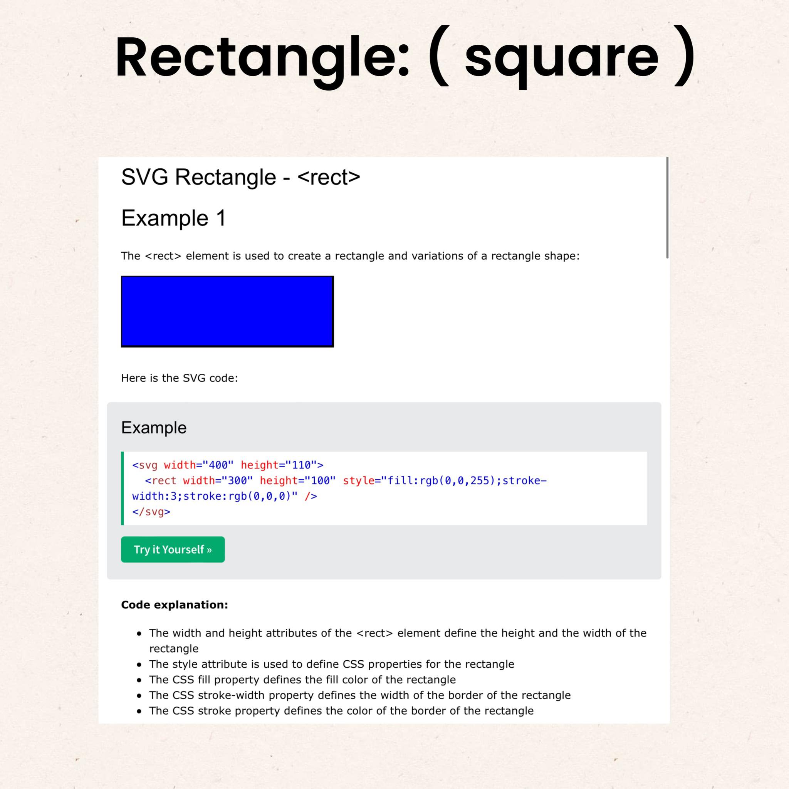
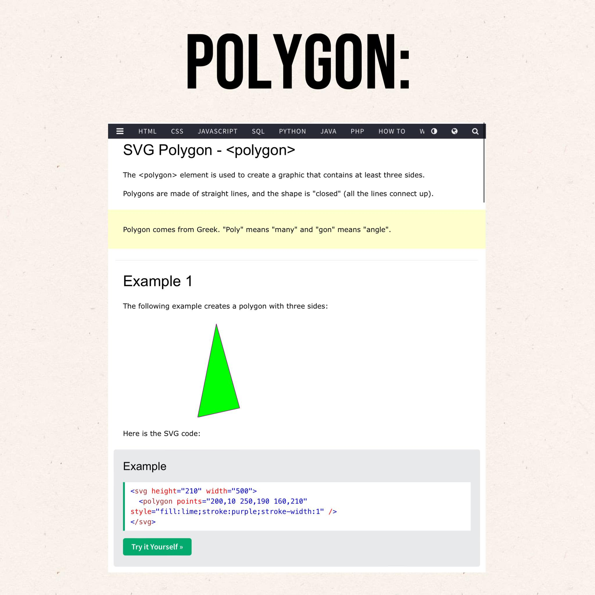

# project-ten-svg-simple-logo-maker-challenge
Command line application featuring node.js and Inquirer 8.2.4 to generate a simple logo

## Description

A command line application to generate a simple logo through user input featuring Node and Inquirer 8.2.4.
User/me will have questions such as; Enter 3 characters for logo text, Choose a color for text, Select a shape: (circle, triangle, or square), Pick a color for that shape. Colors can be a color keyword OR a hexadecimal number. After all choices are made and entered, in the logo.svg file, there should be a new logo with all the choices generated. This application uses Jest for testing.
Image size: 300x200 pixel image.

## Table of Contents

:bookmark_tabs:

- [Installation](#installation)
- [Links](#links)
- [Object-Oriented Programming](#object-oriented-programming)
- [Jest](#jest)
- [Inquirer 8.2.4](#inquirer-824)
- [SVG](#svg)
- [Shapes](#shapes)
- [Text](#texts)
- [TTD](#ttd)
- [Promise](#promise)
- [Inhertiance](#inheritance)
- [Classes](#classes)
- [Objects](#objects)
- [Constructor](#constructor)
- [Callbacks](#callback)
- [Key-Topics](#key-topics)
- [Notes on Application](#notes-on-application)
- [License](#license)
- [How to Contribute](#how-to-contribute)
- [Credits](#credits)
- [Badges](#badges)
- [Tests](#tests)
- [Features](#features)

## Installation

:arrow_down:

:arrow_forward: [Github Link:](https://github.com/pmastropolo/project-ten-svg-simple-logo-maker-challenge)

:arrow_forward: [Youtube Video Link:](https://www.youtube.com/watch?v=d6Dw98sY9rA)

## Links

:open_file_folder:

:arrow_forward: Github link:https://github.com/pmastropolo/project-ten-svg-simple-logo-maker-challenge

:arrow_forward:Video Link:https://www.youtube.com/watch?v=d6Dw98sY9rA

## Object-Oriented Programming

- [Obect Oriented Programming](https://geetikakaushik2020.medium.com/what-is-object-oriented-programming-7f14c5147ee5)
- [What is Object-Oriented Programming](https://www.techtarget.com/searchapparchitecture/definition/object-oriented-programming-OOP)
- 
- 
- 

## Jest

- [Jest Package](https://www.npmjs.com/package/jest)
- [Understanding Jest Mocks](https://medium.com/@rickhanlonii/understanding-jest-mocks-f0046c68e53c)
- [Jest](https://jestjs.io/)
- [Helpful Jest Guide](https://www.testim.io/blog/jest-testing-a-helpful-introductory-tutorial/)
- 
- 
- 
- 
- 

## Inquirer 8.2.4

- [Inquirer 8.2.4](https://www.npmjs.com/package/inquirer/v/8.2.4)
- [Inquirer 8.2.4 on nuget](https://nuget.qite.be/feeds/NPM/inquirer/8.2.4)
- 
## SVG

- [SVG](https://en.wikipedia.org/wiki/SVG)
- [SVG Tutorial](https://developer.mozilla.org/en-US/docs/Web/SVG/Tutorial)
- [Example SVG](https://static.fullstack-bootcamp.com/fullstack-ground/module-10/circle.svg)
- [Scalable Vector Graphics](https://en.wikipedia.org/wiki/Scalable_Vector_Graphics)
- [Basic SVG shapes](https://developer.mozilla.org/en-US/docs/Web/SVG/Tutorial/Basic_Shapes)
- [Text in SVG](https://developer.mozilla.org/en-US/docs/Web/SVG/Tutorial/Texts)
- [SVG VS Code extension](https://marketplace.visualstudio.com/items?itemName=jock.svg)
- [SVG Intro Wiki Schools](https://www.w3schools.com/graphics/svg_intro.asp?fbclid=IwAR2BuYuvu3dGfUkDemR966OEywJUHQxWmd1NKi5De2AXuxCgz0LZXGnJjM8)
- [Things you need to know about working with svgs](https://www.freecodecamp.org/news/things-you-need-to-know-about-working-with-svg-in-vs-code-63be593444dd/)

## Shapes

- [Circle](https://static.fullstack-bootcamp.com/fullstack-ground/module-10/circle.svg)
- [Basic Shapes](https://developer.mozilla.org/en-US/docs/Web/SVG/Tutorial/Basic_Shapes)
- [Circle](https://www.w3schools.com/graphics/svg_circle.asp?fbclid=IwAR1F8OXiiiPdCa3CA69h1qAaTGve2TEZXgHU6wzR5UsevaYb5mxkiIgD6Zk)
- [Rectangle/Square](https://www.w3schools.com/graphics/svg_rect.asp)
- [Polygon/Triangle](https://www.w3schools.com/graphics/svg_polygon.asp)
- 
- 
- 
## Texts

- [Texts](https://developer.mozilla.org/en-US/docs/Web/SVG/Tutorial/Texts)

## TTD

- [TTD](https://www.ibm.com/garage/method/practices/code/practice_test_driven_development/)
- [TTD wiki](https://en.wikipedia.org/wiki/Test-driven_development)
- [What’s the difference between Unit Testing, TDD and BDD?](https://codeutopia.net/blog/2015/03/01/unit-testing-tdd-and-bdd/)
- [Red, Green, Refactor](https://www.codecademy.com/article/tdd-red-green-refactor)
- [ARRANGE-ACT-ASSERT](https://automationpanda.com/2020/07/07/arrange-act-assert-a-pattern-for-writing-good-tests/)

## Promise

- [Promise](https://developer.mozilla.org/en-US/docs/Web/JavaScript/Reference/Global_Objects/Promise)
- [Promise.then()](https://developer.mozilla.org/en-US/docs/Web/JavaScript/Reference/Global_Objects/Promise/then)
- [Promise.catch()](https://developer.mozilla.org/en-US/docs/Web/JavaScript/Reference/Global_Objects/Promise/catch)

## Inheritance

- [Class Inheritance](https://javascript.info/class-inheritance#overriding-a-method)
- [Inheritance and the prototype chain](https://developer.mozilla.org/en-US/docs/Web/JavaScript/Inheritance_and_the_prototype_chain)

## Classes

- [Classes](https://developer.mozilla.org/en-US/docs/Web/JavaScript/Reference/Classes)
- [Subclasses](https://developer.mozilla.org/en-US/docs/Web/JavaScript/Reference/Classes)
- [Class basic syntax](https://javascript.info/class)
- [extends](https://developer.mozilla.org/en-US/docs/Web/JavaScript/Reference/Classes/extends)

## Objects

- [Objects](https://developer.mozilla.org/en-US/docs/Web/JavaScript/Reference/Global_Objects/Object)
- [Object Prototypes](https://developer.mozilla.org/en-US/docs/Learn/JavaScript/Objects/Object_prototypes)
- [Prototypes in JavaScript](https://betterprogramming.pub/prototypes-in-javascript-5bba2990e04b)

## Constructor

- [Constructor](https://developer.mozilla.org/en-US/docs/Web/JavaScript/Reference/Classes/constructor)
- [Function Constructor](https://developer.mozilla.org/en-US/docs/Web/JavaScript/Reference/Global_Objects/Function/Function)
- [JavaScript Constructor Function](https://www.programiz.com/javascript/constructor-function)
- [JavaScript Object Constructors](https://www.w3schools.com/js/js_object_constructors.asp)

## Callback

- [Callback function](https://developer.mozilla.org/en-US/docs/Glossary/Callback_function)

## MISC

- [Visual Studio Marketplace](https://marketplace.visualstudio.com/items?itemName=jock.svg)
- [How to Install the Heroku CLI](https://coding-boot-camp.github.io/full-stack/heroku/how-to-install-the-heroku-cli)
- [Full Stack Blog](https://coding-boot-camp.github.io/full-stack/)
- [Git Stash](https://www.git-scm.com/docs/git-stash)
- [Video Submission Guide](https://coding-boot-camp.github.io/full-stack/computer-literacy/video-submission-guide)
- [Polymorphism](https://en.wikipedia.org/wiki/Polymorphism_(computer_science))
- [this](https://developer.mozilla.org/en-US/docs/Web/JavaScript/Reference/Operators/this)
- [A Brief Introduction to Domain Modeling](https://olegchursin.medium.com/a-brief-introduction-to-domain-modeling-862a30b38353)
- [The different types of tests](https://www.atlassian.com/continuous-delivery/software-testing/types-of-software-testing)
- [How to explain object-oriented programming concepts to a 6-year-old](https://www.freecodecamp.org/news/object-oriented-programming-concepts-21bb035f7260/#:~:text=The%20four%20principles%20of%20object,abstraction%2C%20inheritance%2C%20and%20polymorphism.)
- [Methods Within Constructor vs Prototype in Javascript](https://www.thecodeship.com/web-development/methods-within-constructor-vs-prototype-in-javascript/)
- [NPM list](https://www.javascripttutorial.net/nodejs-tutorial/npm-list/?fbclid=IwAR2rv4hSpePzMXwDaw4z_i3cWcqSHgR42Yxh6naZ8QJN2iWajbvh1s3vNEA)
- [CSS Color Keywords](https://www.w3.org/wiki/CSS/Properties/color/keywords)
- [HTML Color Codes](https://htmlcolorcodes.com/)
- [What is Object-Oriented Programming](https://www.techtarget.com/searchapparchitecture/definition/object-oriented-programming-OOP)
- 

## Key-Topics

### Notes on Application

## License

:heavy_exclamation_mark:

MIT License

## How to Contribute

:tada:

N/A

## Credits

:name_badge:

N/A

## Badges

:trophy:

N/A

## Tests

N/A

## Features

:sparkler:

N/A